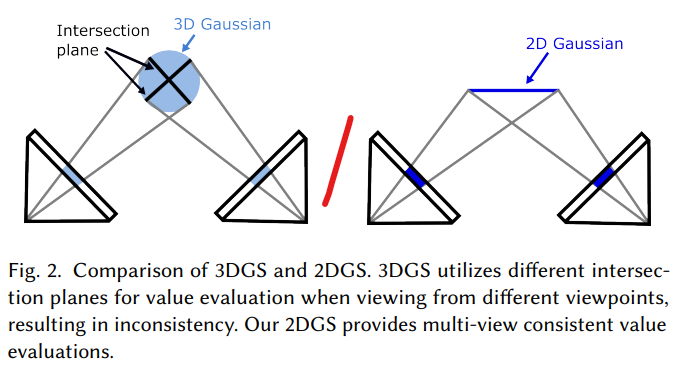
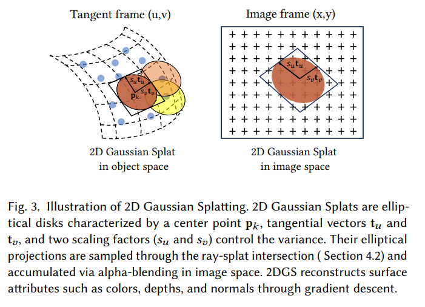

# 2DGS论文阅读笔记
[Problem] 3DGS fails to represent surface due to multi-view inconsistency  
  

!!! note "以旋转相机与平移相机为例有助于解释这一inconsistency"  

2DGS:collapse the 3D volume into a set of 2D oriented planar Gaussian disks  
[Contribution] 
1. a perspective-accurate 2D splatting process utilizing ray-splat intersection and rasterization  
2. incorporate two regularization terms:depth distortion and normal consistency  
3. SOTA in geometry reconstruction and NVS results  
## 3DGS
3D Gaussian:  
$$
\mathcal{G}=\exp(-\frac 1 2(p-p_k)^T\Sigma^{-1}(p-p_k))
$$
$\Sigma=RSS^TR^T,S:$scaling,$R$:rotation  
camera coordinates:$\Sigma'=JW\Sigma W^TJ^T,W$:world-to-camera transform,$J$:affine transformation  
volumetric alpha blending:  
$$
c(x)=\sum_{k=1}^Kc_k\alpha_k\mathcal{G}_k^{2D}(x)\Pi_{j=1}^{k-1}(1-\alpha_j\mathcal{G}_j^{2D}(x))
$$
$k$:index of Gaussian primitives,$\alpha_k$:alpha value,$c_k$:view-dependent appearance  
[Challenges] 
1. volumetric radiance representation conflicts with the thin nature of surfaces  
2. 3DGS does not natively model surface models  
3. rasterization process lacks multi-view consistency -> varied 2D intersection plane for different viewpoints  
4. affine matrix only yield accurate projections **near** the center  
## 2DGS
  
$$
\begin{aligned}
P(u,v)&=p_k+s_ut_uu+s_vt_vv=H(u,v,1,1)^T\\
H&=\begin{bmatrix}s_ut_u&s_vt_v&0&p_k\\0&0&0&1\end{bmatrix}=\begin{bmatrix}RS&p_k\\0&1\end{bmatrix}\\
\mathcal{G}(u)&=\exp(-\frac{u^2+v^2}{2})
\end{aligned}
$$
$p_k,(s_u,s_v),(t_u,t_v)$ are learnable parameters  
Then multiply by world-to-camera transform matrix $W$  
$$
x_{cam}=WH(u,v,1,1)^T
$$

## Key advantage
1. view consistency  
2. correct ray-splat intersection  
3. regularization for surface fidelity(accuracy)
4. real-time rendering

## working pipeline
### stage 1:input and initialization  
Input:multi-view images,(optional) sparse point cloud from SfM  
Goal:initial guess(2D disks)  
disk parameters:3D center position,tangent vector pair,surface normal,scaling factor,color and opacity(transparency)  
### stage 2:tangent-plane paramenterization  
local 2D coordinate system and opacity and color intensity for each disk  
### stage 3:transformation to camera space
compute transformation matrix $H$  
get the disk on camera coordinate by multiplying world-to-camera transform $W$  
### stage 4:perspective-correct ray-splat intersection
compute where the ray intersacts the disk's plane  
$$
u(x) = \frac{h_v^2h_v^4-h_u^4h_v^2}{h_u^1h_v^2-h_u^2h_v^1},v(x) = \frac{h_u^4h_v^1-h_u^1h_v^4}{h_u^1h_v^2-h_u^2h_v^1}
$$
### stage 5:filtering and stability
low-pass filter to prevent projected area from shrinking  
$$
\hat{g}(x)=max\left\{G(u(x)),G(\frac{x-c}{\sigma})\right\}
$$
### stage 6:Alpha Compositing(Color accumulation)
rendering process:front-to-back blending rule(similar to 3DGS but over surface-aligned splats)  
### stage 7:differentiable optimization 
update each disk parameters using gradient descent  
loss function:
$$
L=L_c+\alpha_dL_d+L_n
$$
$L_c$:RGB reconstruction,$L_d$:Depth distortion,$L_n$:normal consistency  
### stage 8:output -> real-time rendering and geometry extraction
output:rendered image,depth maps,triangle mesh  
## Future work
[limitations]  
1. assume the surfaces with full opacity -> difficulty in dealing with semi-transparent surfaces such as glass  
2. favors texture-rich areas  
3. trade-off between quality and geometry -> potential over-smoothing  

## project notes
bounded mesh for indoor object reconstruction  
SAM(Segment Anything) for object extraction from video  
depth_trunc:define the max effective distance  