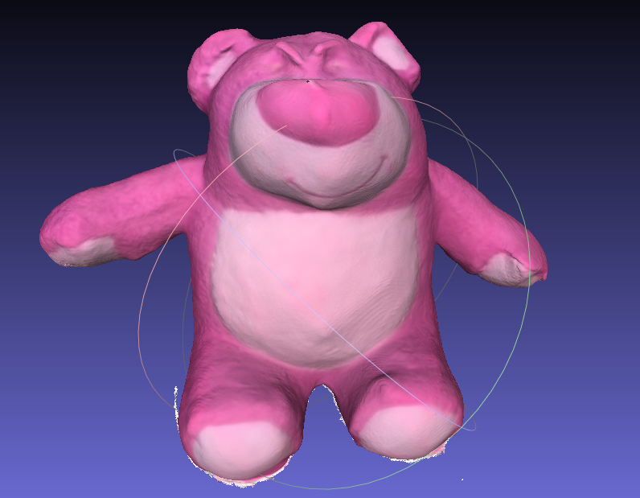
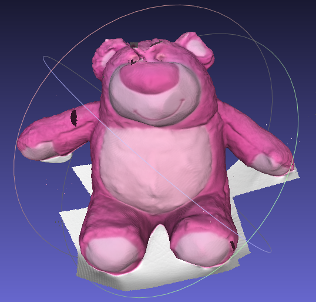
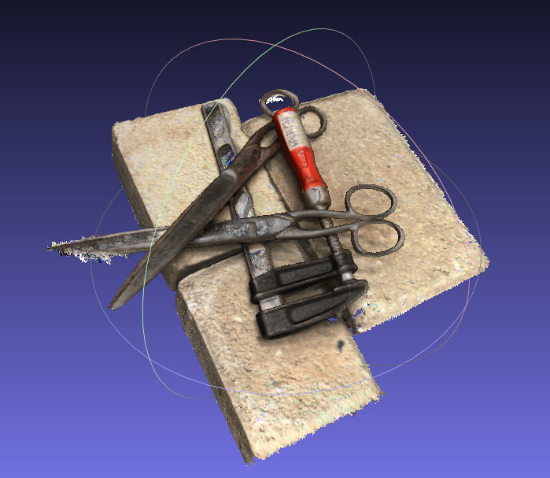
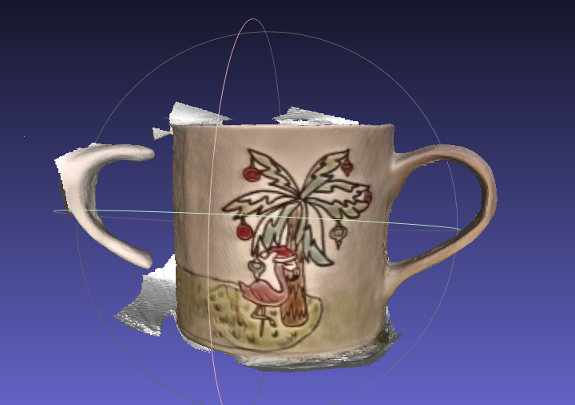

               

    
计算机视觉导论   Project:基于2DGS的三维重建
    
    
  
杨亿酬 3230105697 
韩泰睿 323010470 
2025-11-27 ~ 2025-12-21
    

### 1.问题分析  
`3DGS`在物体表面重建的问题上会面临多视角不一致的问题，`2DGS`的提出解决了这个问题，本项目尝试对自行采集的数据进行处理重建出三维结构（点云和相机位姿）并进一步通过`2DGS`恢复出精细的物体结构，进行自由视点渲染。  
针对弱纹理的物体，尝试通过基于`2DGS`的改进得到良好的表面。  
   

### 2.基础实现
+ 自行采集玩偶熊的视频，先使用`ffmpeg`命令处理视频，每0.5秒抽取一帧保存为图片
+ 再通过`SAM(Segment Anything Model)`进行物体提取
+ 接着使用`colmap`进行稀疏重建
+ 最后通过`2DGS`的`pipeline`完成训练与渲染，得到多视角渲染的三维结构。  
   

### 3.进阶探索
对比`DTU`数据集在`2DGS,PGSR,Sparse2DGS`上的效果，发现PGSR对物体弱纹理区域能够获得精细地重建效果。  
`PGSR`基于平面约束，无偏深度估计与多视角正则既解决了`3DGS`多视角不一致的问题又在引入了深度估计与平面约束解决了`2DGS`高斯圆片飘浮与缺少深度信息导致弱纹理区域几何信息获取困难的问题。  
通过`PGSR`与（可能的）`SAGA(Segment Any 3D Gaussians)`实现弱纹理马克杯的精细重建并获得良好的表面。  

### 4.实验结果
#### 基础实现
 
这是我们对玩偶熊的`2DGS`重建结果  
#### 进阶探索
##### lotso
 

这是我们对玩偶熊的`PGSR`重建结果
对比`2DGS`结果可以看出`PGSR`的精度更高，对褶皱的处理效果更好
##### DTU
 
这是我们对标准集`SCAN37`的重建结果
##### mug
 
这是对马克杯的`PGSR`重建结果
  

### 5.小组分工
杨亿酬：论文调研，思路提出，部分数据采集与训练，汇报展示  
韩泰睿：数据采集，数据处理，训练与结果对比，效果呈现  

